# Naver-Webtoon-Talking-Head

# Introduction

Neural Talking Head models show a promising results on various domains such as real human faces and portrait. I conductsimple experiments to investigate the behaviors of them. Currently, most of experiments are conduected based on this [repository](https://github.com/shrubb/latent-pose-reenactment)

# Dataset
I collected a handful of webtoon face images from a variety of webtoons. Roughly, each identity has 1 - 16 images for finetuning.

 

# Results (One example image / Talking Heads)
 

## True Beauty (여신강림)
 

    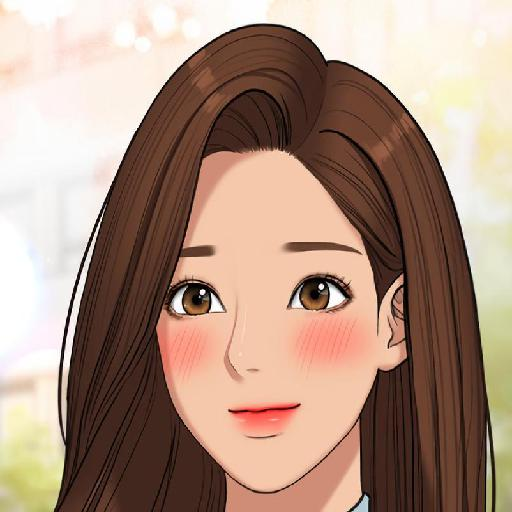
    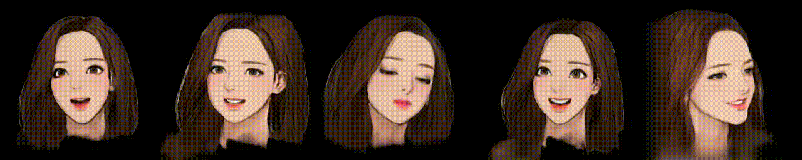

    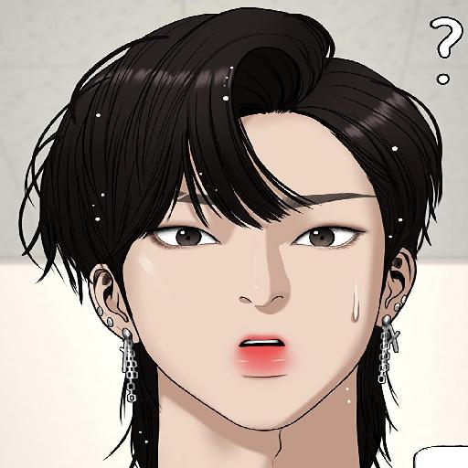
    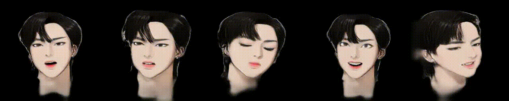

    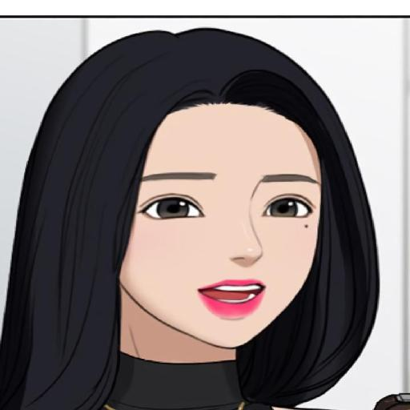
    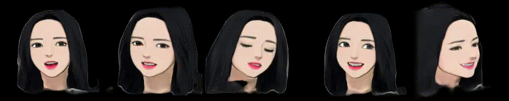

 

## How to Fight (싸움독학)
 

    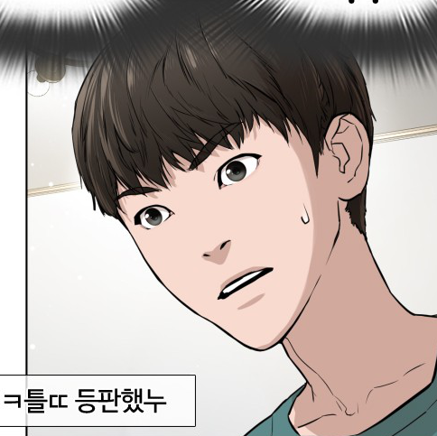
    

    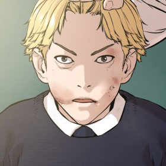
    

    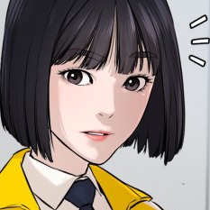
    

 

## Free Draw (프리드로우)
 

    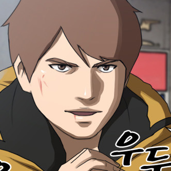
    

    
    

    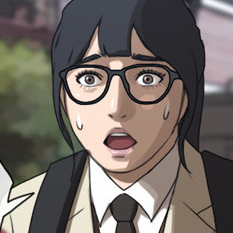
    

 

## Spirit Fingers (스피릿 핑거스)
 

    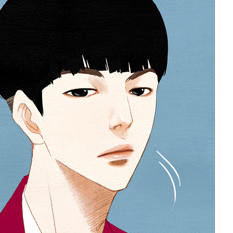
    

    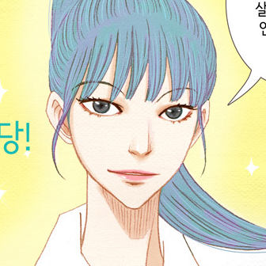
    

    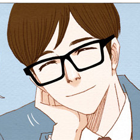
    

 

## Weak Hero (약한영웅)
 

    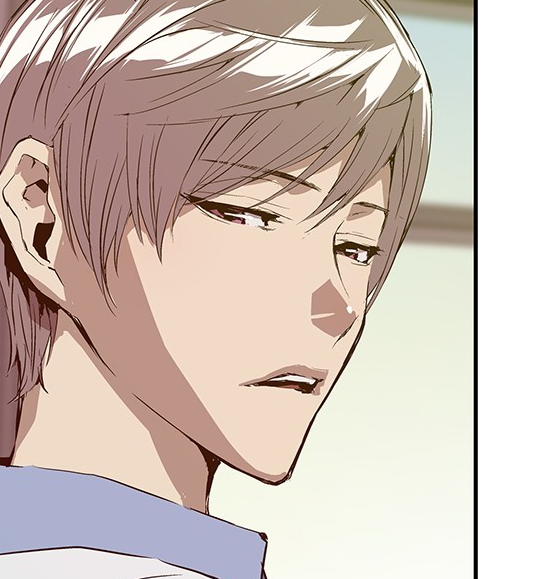
    

    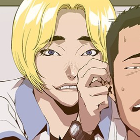
    

    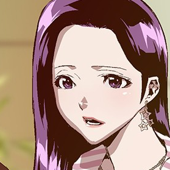
    

 

## Mon, I'm Sorry (맘마미안)
 

    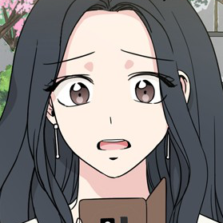
    

    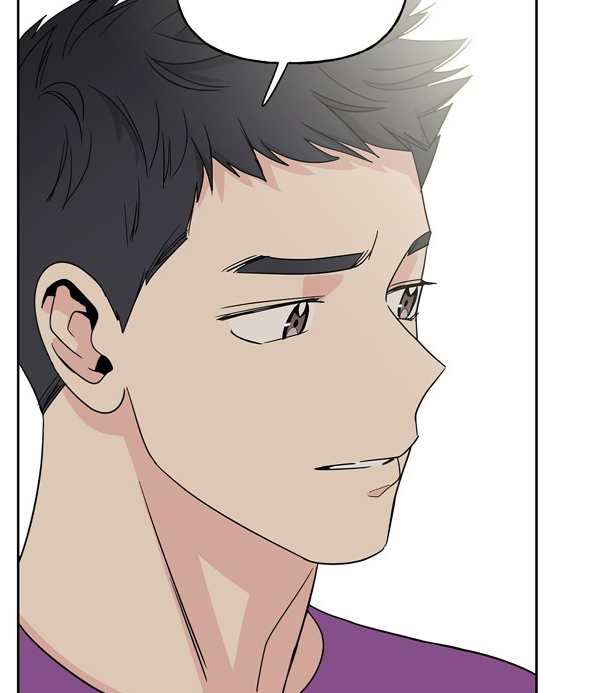
    

    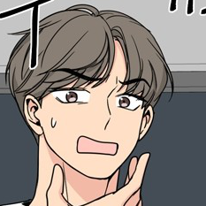
    

 

## Office Her Story (오피스 누나 이야기)
 

    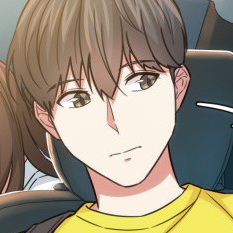
    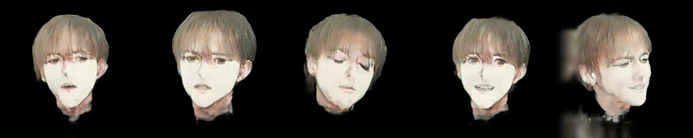

    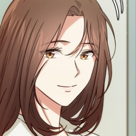
    

 

## The Girl Downstairs (이두나!)
 

    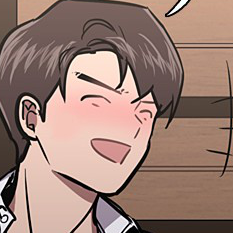
    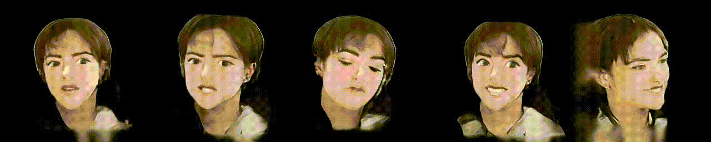

    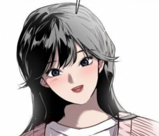
    

 

## Castle (캐슬)
 

    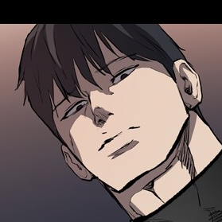
    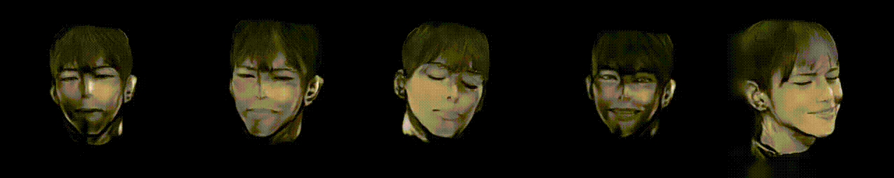

    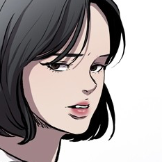
    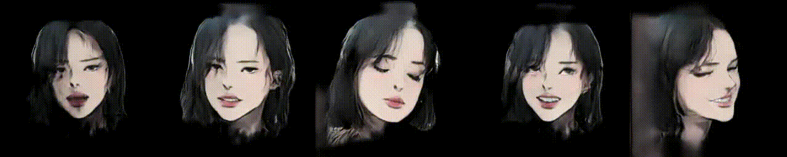

 

## The End of Relationship (관계의 종말)
 

    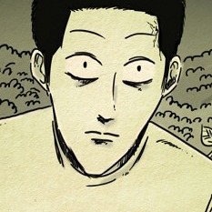
    

    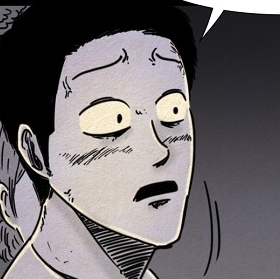
    

    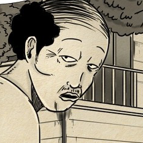
    

 

## Boxer (복서)
 

    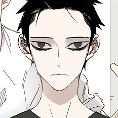
    

    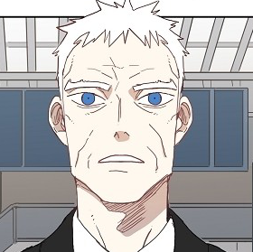
    

    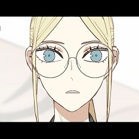
    

 

## Jisoo, Yooa, Paint Boy
 

    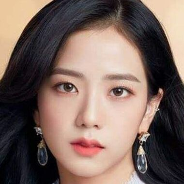
    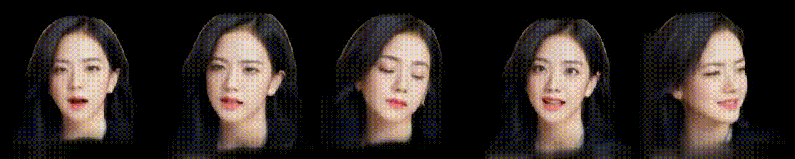

    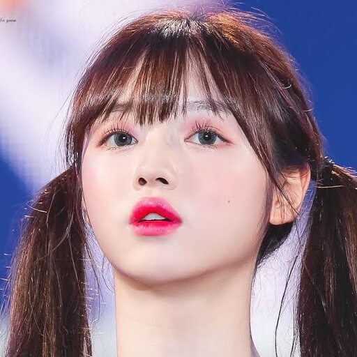
    

    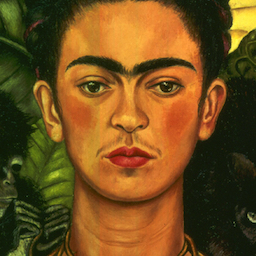
    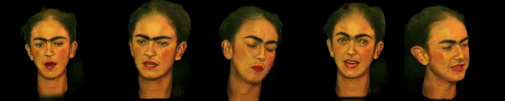

 

# Issues on training with Webtoon dataset

* There are several issues which cause the performance degration and I remedy such issues by simply modifying the hyperparamters and not using some parts of original finetuning strategy.
* Especially, segmentation map estimation is very unstable, so I recommend to check out the segmentation map outputs first. And if the estimations are not valid,removing *dice* loss and omitting mask composition process. (Unfortunately, background blurry artifact arises.)

