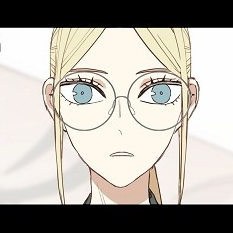
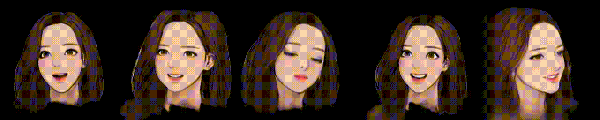
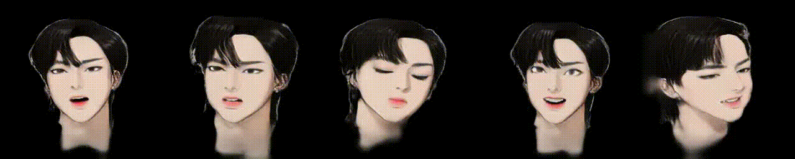
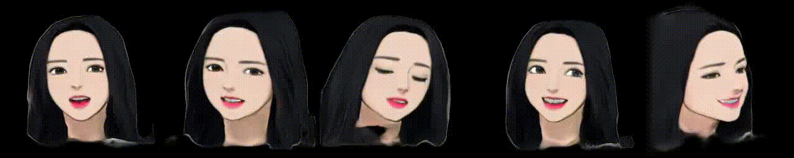
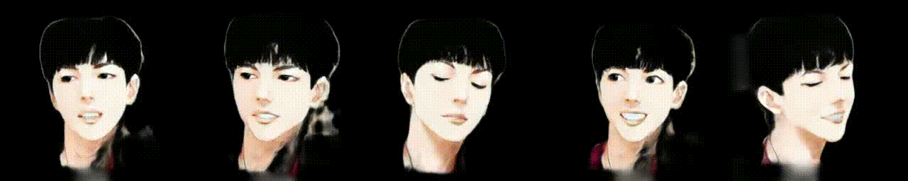
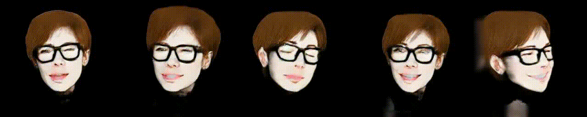

# Naver-Webtoon-Talking-Head

# Introduction

Neural Talking Head models show a promising results on various domains such as real human faces and portrait. I conductsimple experiments to investigate the behaviors of them. Currently, most of experiments are conduected based on this [repository](https://github.com/shrubb/latent-pose-reenactment)

# Dataset
I collected a handful of webtoon face images from a variety of webtoons. Roughly, each identity has 1 - 16 images for finetuning.

# Results

## True Beauty (여신강림)

    
    

    
    

    
    

## How to Fight (싸움독학)

    
    

    
    

    
    

## Free Draw (프리드로우)

    
    

    
    

    
    

## Spirit Fingers (스피릿 핑거스)

    
    

    
    

    
    

## Weak Hero (약한영웅)

    
    

    
    

    
    

## Issues on training with Webtoon dataset

* There are several issues which cause the performance degration and I remedy such issues by simply modifying the hyperparamters and not using some parts of original finetuning strategy.
* Especially, segmentation map estimation is very unstable, so I recommend to check out the segmentation map outputs first. And if the estimations are not valid,removing *dice* loss and omitting mask composition process. (Unfortunately, background blurry artifact arises.)

